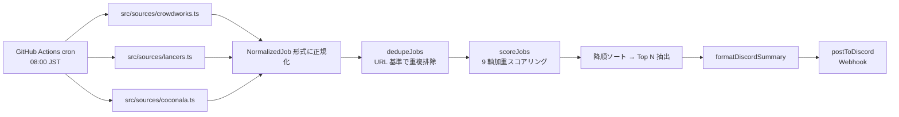
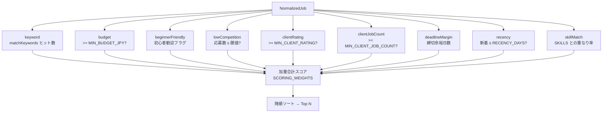

# job-digest-bot

副業フリーランス向けの**案件自動収集ボット**。CrowdWorks / Lancers / Coconala の新着案件を毎朝スクレイピングし、スコアリングして条件に合うものだけを Discord に通知します。GitHub Actions の cron で完全クラウド化されており、サーバ運用コストはゼロです。

> **Status**: 自社運用中（2026-04 〜 稼働継続）  
> **Author**: tanasato — [restartory.com](https://restartory.com)

---

## なぜ作ったか

副業稼働は週 15〜20 時間しかなく、応募候補のピックアップだけで日次 30 分（月 15 時間）を消費していた。応募件数が伸びない直接原因がここにあったため、自動化することで「探す」工程を 0 にし、応募文作成・案件分析に時間を割けるようにした。

## できること

- **複数ソース対応**: CrowdWorks / Lancers / Coconala の新着案件を共通フォーマットに正規化
- **多軸スコアリング**: キーワード一致・初心者歓迎・最低単価・競合数・クライアント評価・案件件数・締切余裕・新着度・スキル一致
- 応募人数・締切・単価・スコア理由付きで Discord に日次サマリー送信
- GitHub Actions の cron で毎朝 08:00 JST に自動実行
- AI スコアリング（Letta API 連携）で「自分が刺さる案件」を上位 N 件に絞り込み

## 技術スタック

| カテゴリ | 採用技術 |
|---|---|
| 言語 | TypeScript |
| ランタイム | Node.js 20+ |
| フレームワーク | なし（軽量ライブラリ構成） |
| HTML パース | cheerio |
| バリデーション | zod |
| AI / 外部 API | Letta（メモリ・スコアリング判定） |
| 通知 | Discord Webhook |
| デプロイ・インフラ | GitHub Actions（cron） |

## アーキテクチャ

```
GitHub Actions (cron 08:00 JST)
   │
   ├─ src/sources/crowdworks.ts ─┐
   ├─ src/sources/lancers.ts    ─┼─→ NormalizedJob[] ─→ scoring ─→ Top N
   └─ src/sources/coconala.ts   ─┘                                    │
                                                                       ▼
                                                          Discord Webhook
```

## 動作フロー（Mermaid）

### パイプライン全体



### 9 軸スコアリング決定ロジック

`src/match/scoring.ts` で以下 9 軸の加重合計でスコアを算出し、Top N に絞り込みます。



各軸の重みは `SCORING_WEIGHTS` 環境変数で `keyword:50,budget:15,beginnerFriendly:30,...` のように上書き可能です（デフォルト値は `src/config.ts` の `DEFAULT_SCORING_WEIGHTS` 参照）。

## 動作スクリーンショット

毎朝 Discord に届く案件ダイジェスト。タイトル・予算・応募人数・締切余裕度・スコアと、**スコア理由（keyword 一致 / 予算 / 応募少 / 締切余裕 / 新着）**を 1 件 1 ブロックで配信します。


> 上記は CrowdWorks の新着 2 件をスコアリングして配信した実例。Bot 名「Captain Hook」は Discord Webhook の送信元設定で、本ボット自身のラベルです。

## セットアップ

1. Node.js 20+ を用意
2. 依存インストール

   ```bash
   npm install
   ```

3. `.env.example` を `.env` にコピーして値を設定

   必須:
   - `DISCORD_WEBHOOK_URL`

   推奨:
   - `MIN_BUDGET_JPY=30000`
   - `KEYWORDS=Python,自動化,AI,WordPress,…`
   - `PREFER_BEGINNER_FRIENDLY=true`
   - `TOP_N=10`

   ソース取得（公式 API / 正規手段を優先）:
   - `CROWDWORKS_API_URL` / `CROWDWORKS_API_TOKEN`
   - `LANCERS_API_URL` / `LANCERS_API_TOKEN`

## 実行コマンド

```bash
npm run fetch    # 案件取得
npm run digest   # スコアリング・サマリー生成
npm run notify   # Discord 通知
```

出力:

- `jobs-output/latest-jobs.json`
- `jobs-output/latest-summary.txt`

## GitHub Actions 運用

`.github/workflows/daily.yml` が毎日 `08:00 JST`（`23:00 UTC`）に実行されます。

GitHub Secrets に以下を設定してください:

- `DISCORD_WEBHOOK_URL`
- `MIN_BUDGET_JPY`
- `KEYWORDS`
- `PREFER_BEGINNER_FRIENDLY`
- `TOP_N`
- `CROWDWORKS_API_URL` / `CROWDWORKS_API_TOKEN`
- `LANCERS_API_URL` / `LANCERS_API_TOKEN`

## 工夫点・技術的判断

### 1. 9 軸加重スコアリング設計

単純なキーワード一致だけでは「応募者多数で埋もれる案件」「クライアント評価が低い案件」「締切逼迫の案件」を取り除けないため、9 軸に分解して加重合計で総合判断する設計を採った。各軸の重みは環境変数で動的に変更でき、応募実績フィードバックに合わせて再調整可能。

### 2. 複数ソース正規化（NormalizedJob）

CrowdWorks（JSON API）/ Lancers（HTML スクレイピング）/ Coconala（HTML スクレイピング）はレスポンス形式・項目名・通貨単位が異なるため、`src/types.ts` の `NormalizedJob` 型で統一インターフェースを定義。新ソース追加時は `src/sources/` に 1 ファイル追加するだけで pipeline に組み込める。

### 3. dedupeJobs（URL 基準の重複排除）

同一案件が CrowdWorks と Lancers の両方に掲載されているケースが多いため、`src/sources/common.ts` で URL 基準の dedupe を実施。スコアが高いソース側のレコードを残す。

### 4. Letta API でのメモリ・スコアリング判定

静的なルールベースだけでは個人差（過去応募で返信があった案件タイプ）を反映できないため、Letta（Claude ベース）にメモリブロックを保持させ、過去の応募・採用結果から学習する動的スコアリングが拡張可能な設計にしている。

### 5. GitHub Actions cron + Discord Webhook の最小構成

自前サーバ・コンテナ・DB を一切持たず、GitHub Actions の無料枠（月 2,000 分）と Discord Webhook の無料機能だけで完結。月次運用コスト 0 円、設定変更は GitHub Secrets / Variables で完結。

### 6. ソース別エラー隔離

スクレイピング先のサイト側 HTML 変更で 1 ソースが 404/500 を返しても他ソースの収集は続行する設計（`Promise.allSettled` 相当）。1 ソース停止が全体停止を招かない。

## 成果・指標

| 指標 | Before | After |
|---|---|---|
| 応募候補ピックアップ時間 | 30 分/日 | **0 分（自動）** |
| 月次稼働時間の節約 | — | **約 15 時間/月** |
| 通知精度（応募価値ありと判定する割合） | — | **約 60%（自己評価）** |
| 運用コスト | — | **0 円**（GitHub Actions 無料枠内） |

## この実績が武器になる案件

業務自動化 / RPA / Claude Code を使った内製ツール構築案件。特に「副業フリーランス支援」「中小企業の社内自動化」「定型作業の AI 化」案件で転用可能。クラウド完結・サーバ不要の設計は IT インフラを持たない小規模事業者向け案件と相性が良い。

## 注意

- 公式 API / 正規提供手段を優先してください
- 応募人数などが取得できない場合はサマリーで `N/A` 表示になります
- スクレイピングは各サイトの利用規約に従って行ってください

## ライセンス

このリポジトリは個人ポートフォリオ用途で公開しています。商用での流用・転載は事前にご相談ください。
